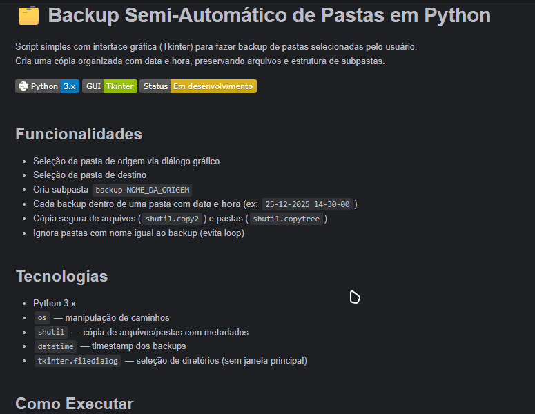

# 🗂️ Backup Semi-Automático de Pastas em Python

Script simples com interface gráfica (Tkinter) para fazer backup de pastas selecionadas pelo usuário.  
Cria uma cópia organizada com data e hora, preservando arquivos e estrutura de subpastas.


## Demonstração Rápida


## Funcionalidades

- Seleção da pasta de origem via diálogo gráfico
- Seleção da pasta de destino
- Cria subpasta `backup-NOME_DA_ORIGEM`
- Cada backup dentro de uma pasta com **data e hora** (ex: `25-12-2025 14-30-00`)
- Cópia segura de arquivos (`shutil.copy2`) e pastas (`shutil.copytree`)
- Ignora pastas com nome igual ao backup (evita loop)

## Tecnologias

- Python 3.x
- `os` — manipulação de caminhos
- `shutil` — cópia de arquivos/pastas com metadados
- `datetime` — timestamp dos backups
- `tkinter.filedialog` — seleção de diretórios (sem janela principal)

## Como Executar

1. Clone o repositório:
   ```bash
   git clone https://github.com/Tellth/backup-semi-automatico-python.git
   cd backup-semi-automatico-python
2. Execute o programa:
   ```bash
   python backup_pastas_tkinter.py
